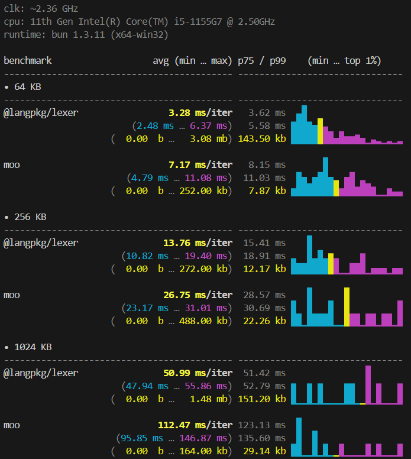

<!-- ╔══════════════════════════════ BEG ══════════════════════════════╗ -->

<br>
<div align="center">
    <p>
        
    </p>
</div>

<div align="center">
    <p align="center" style="font-style:italic; color:gray;">
        Fast, general-purpose lexer for building language tooling.<br>
        <b>Up to ~2.5x faster than moo on equivalent specs</b>.
        <br>
    </p>
    
    <a href="https://github.com/langpkg"></a>
    <br>
    
    
    <br>
    
    
    
</div>
<br>

<!-- ╚═════════════════════════════════════════════════════════════════╝ -->


<!-- ╔══════════════════════════════ DOC ══════════════════════════════╗ -->

- ## Benchmark

    

    > _**To run the benchmark, use: `bun run bench`**_

    > _**To check the benchmark code, read: [`./bench/index.bench.ts`](./bench/index.bench.ts).**_

    <br>
    <br>


- ## Quick Start 🔥

    ```bash
    bun add @langpkg/lexer
    # or
    npm install @langpkg/lexer
    ```

    ```ts
    import { compile, keywords } from '@langpkg/lexer'

    const lexer = compile({
        WS      : /[ \t]+/,
        NL      : { match: /\n/, lineBreaks: true },
        NUM     : /[0-9]+/,
        IDENT   : { match: /[a-zA-Z_][a-zA-Z0-9_]*/, type: keywords({ KW: ['if','else','return'] }) },
        EQ3     : '===',
        ARROW   : '=>',
        EQ      : '=',
        PLUS    : '+',
        SEMI    : ';',
    })

    lexer.reset('if x === 1 { return x + 1; }')

    let tok
        while ((tok = lexer.next()) !== undefined) {
        console.log(tok.type, JSON.stringify(tok.value))
    }
    // KW    "if"
    // WS    " "
    // IDENT "x"
    // EQ3   "==="
    // NUM   "1"
    // ...
    ```

    <br>
    <br>

- ## Documentation 📑

    - ### How it works

        _The lexer compiles your spec into a **per-character dispatch table**:_

        1. Each ASCII charCode maps to an ordered list of candidate rules.

        2. `next()` does one array lookup on `charCodeAt(pos)`.

        3. Candidates are tried with `re.test(buf)` (sticky regex, no `exec`, no array allocation).

        4. 94%+ of charCodes have exactly one candidate -- they skip the loop entirely.

        > _**No combined mega-regex. No alternation backtracking.**_
        >
        > _**Each rule has its own sticky regex anchored at the current position.**_

        <div align="center">  </div>
        <br>

    - ### API

      - #### `Span`

        > Represents a byte range in the input.

        ```ts
        interface Span {
            start : number  // Byte offset from start of input
            end   : number  // Byte offset after the match (exclusive)
        }
        ```

      - #### `compile(spec, options?): Lexer`

        > Compiles a rule spec into a `Lexer`. Call once, reuse many times.

        ```ts
        const lexer = compile({
          // string literal -- exact match
          PLUS  : '+',

          // multiple literals for one type
          OP    : ['+=', '+'],

          // RegExp -- no /g /i /y /m flags, no capture groups
          NUM   : /[0-9]+/,

          // full rule object
          NL    :  { match: /\n/, lineBreaks: true },

          // value transform -- token.value is the stripped version, token.text is raw
          STR   : { match: /"[^"]*"/, value: s => s.slice(1, -1) },

          // error recovery -- returns an error token instead of throwing
          ERR   : { error: true },
        })
        ```

        **Matching priority:**

        1. Longer string literals always beat shorter ones -- `'==='` beats `'=>'` beats `'='`, regardless of declaration order.

        2. RegExp rules sharing the same first character run in declaration order, after all string literals.

        <div align="center">  </div>
        <br>

      - #### `keywords(map): TypeTransform`

        > Remaps matched identifiers to keyword types.
        Handles the longest-match edge case correctly -- `className` is never split into `class` + `Name`.

        ```ts
        compile({
            IDENT: {
                match   : /[a-zA-Z_][a-zA-Z0-9_]*/,
                type    :  keywords({
                    'kw-if'     : 'if',
                    'kw-else'   : 'else',
                    KW          : ['while', 'for', 'return'],  // multiple keywords, one type
                }),
            },
        })
        ```

        <div align="center">  </div>
        <br>

      - #### `lexer.reset(input?, state?): this`

        > Load new input. Resets position to 0, line/col to 1 (unless `state` is passed).

        > Returns `this` for chaining: `lexer.reset(src).next()`.

      - #### `lexer.next(): Token | undefined`

        > Return the next token, or `undefined` at EOF.

      - #### `lexer.save(): LexerState`

        > Snapshot `{ line, col }` for later `reset()`.

      - #### `lexer.formatError(token, message?): string`

        > Return a human-readable error string: `"<message> at line N col N"`.

        <div align="center">  </div>
        <br>

      - #### Token fields

        | Field        | Type     | Description                                               |
        | ------------ | -------- | --------------------------------------------------------- |
        | `type`       | `string` | Token type name from the spec                             |
        | `text`       | `string` | Matched text, transformed if `value()` was set            |
        | `span`       | `Span`   | Byte position range { start, end }                        |
        | `toString()` |          | Returns `text`                                            |


    <br>
    <br>

- ## Credits ❤️

    > Inspired by [moo](https://github.com/no-context/moo) -- I kept the same
    familiar API (`compile`, `keywords`, `reset`, `next`) while replacing the
    internals with a per-character dispatch table and per-rule sticky regexes,
    which eliminates alternation backtracking and gives ~3x better throughput.

    > Built as part of the Mine language compiler toolchain.

<!-- ╚═════════════════════════════════════════════════════════════════╝ -->


<!-- ╔══════════════════════════════ END ══════════════════════════════╗ -->

<br>
<br>

---

<div align="center">
    <a href="https://github.com/maysara-elshewehy"></a>
</div>

<!-- ╚═════════════════════════════════════════════════════════════════╝ -->